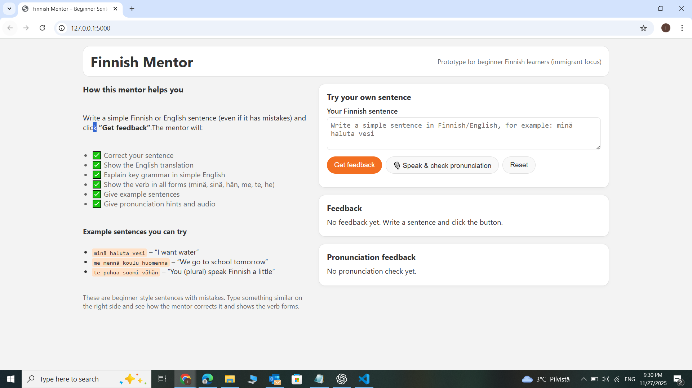
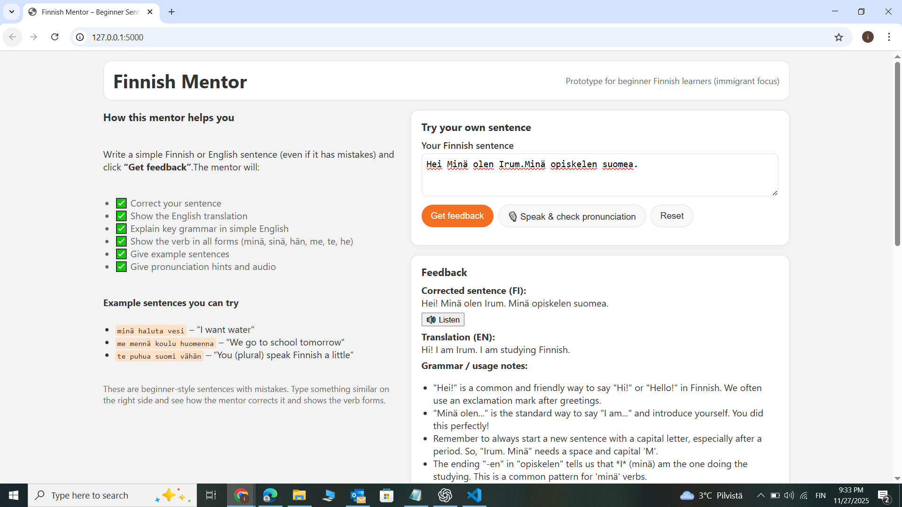
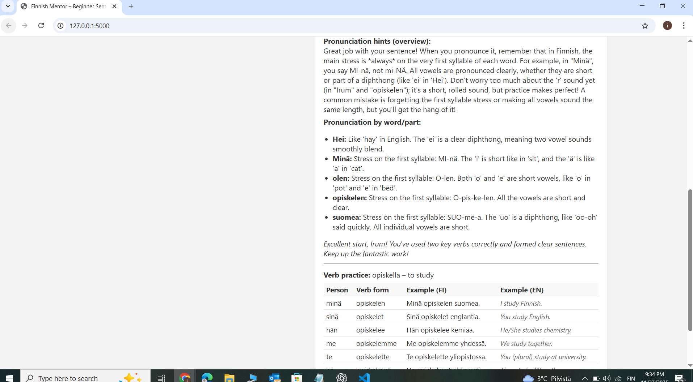
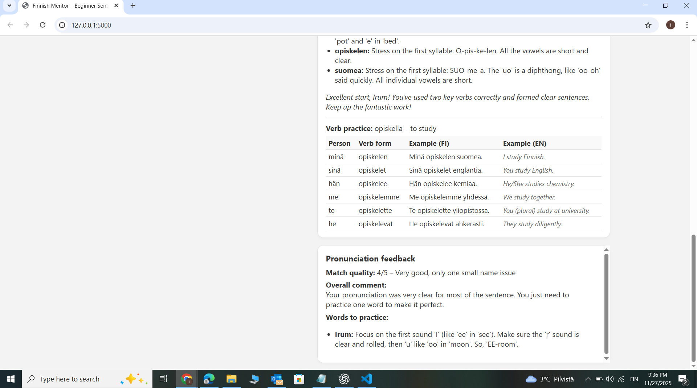

# Finnish Mentor – AI-Powered Support Tool for Beginner Finnish Learners

This project is my submission for the Metropolia UAS AI Development Project assignment.

Finnish Mentor is a small Flask app that uses a Large Language Model (Gemini) to help beginner Finnish learners, especially international and immigrant students at Metropolia. It gives instant corrections, grammar notes, pronunciation support, and verb tables in a simple and friendly way.

The goal is to show how AI can support practical learning needs inside the university.

---

## Why this app is useful for Metropolia

Metropolia has many international students who struggle with:

- building confidence in writing Finnish
- understanding grammar endings
- pronouncing Finnish sounds (y, ä, ö, r)
- learning verb conjugations
- getting feedback outside class

Teachers and tutors can’t always give one-to-one help.  
This app works as a small “AI mentor” students can use anytime.

The idea can expand into a university-wide Finnish assistance tool for integration and study success.

---

## Key features

- Corrects simple Finnish or English learner sentences
- Gives clear grammar explanations in simple English
- Shows full verb conjugation (minä, sinä, hän, me, te, he)
- Generates example sentences
- Provides pronunciation hints + per-word tips
- Speaks the corrected Finnish sentence
- Lets the user speak and get pronunciation evaluation
- Clean vanilla HTML + JS frontend
- Flask backend with Gemini API

---

## How to run the project

### 1. Clone the repository

```bash
git clone https://github.com/IrumShehryar/Finnish-mentor.git
cd Finnish-mentor

2. Create a virtual environment

Windows:

python -m venv .venv
.\.venv\Scripts\Activate.ps1


macOS/Linux:

python3 -m venv .venv
source .venv/bin/activate

3. Install dependencies
pip install -r requirements.txt

4. Add your Gemini API key

Create a .env file:

GEMINI_API_KEY=your_api_key_here


(The .env.example file shows the structure.)

5. Run the app
python app.py


Open:

http://127.0.0.1:5000


The app will load in your browser.

## Screenshots

### Main interface


### Feedback example



### Pronunciation page


To use this, create the folder:

## Project structure

Finnish-mentor/
├─ app.py
├─ requirements.txt
├─ .env.example
├─ README.md
├─ .gitignore
├─ templates/
│ └─ index.html
└─ static/
├─ style.css
├─ spoken-finnish.js
└─ screenshots
```

## Technologies used

### Backend

- Python
- Flask
- Gemini API (google-genai)
- python-dotenv

### Frontend

- HTML
- CSS
- Vanilla JavaScript
- Web Speech API for text-to-speech and speech recognition

## Notes for Metropolia recruiters

This project shows:

- I can build a complete full-stack feature from scratch
- I understand Flask routing, JSON APIs, and frontend integration
- I can work with LLM prompts and structure JSON reliably
- I can design a clear UI without heavy frameworks
- I can create practical solutions to real student needs
- I understand good project setup (venv, .gitignore, README, env handling)
- I can extend this into a wider AI tool for language support or internal services

I'm happy to explain design choices, prompt logic, or code during the interview.

## Possible future improvements

- Save student progress and history
- Personalised vocabulary practice
- UI for teachers to see common mistakes
- Support for other languages (Arabic, Urdu, Somali, Mandarin)
- Integration into OMA or Moodle
- Fully responsive mobile UI
